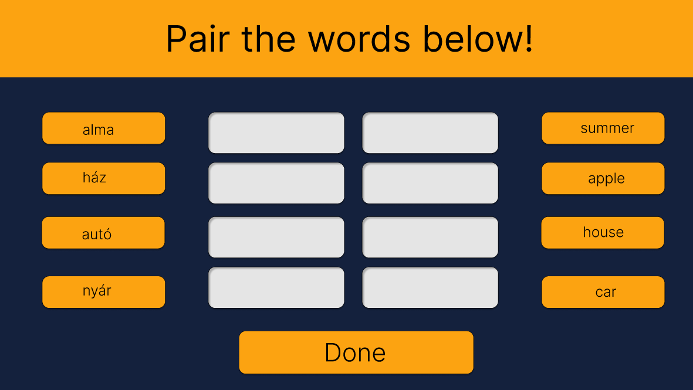
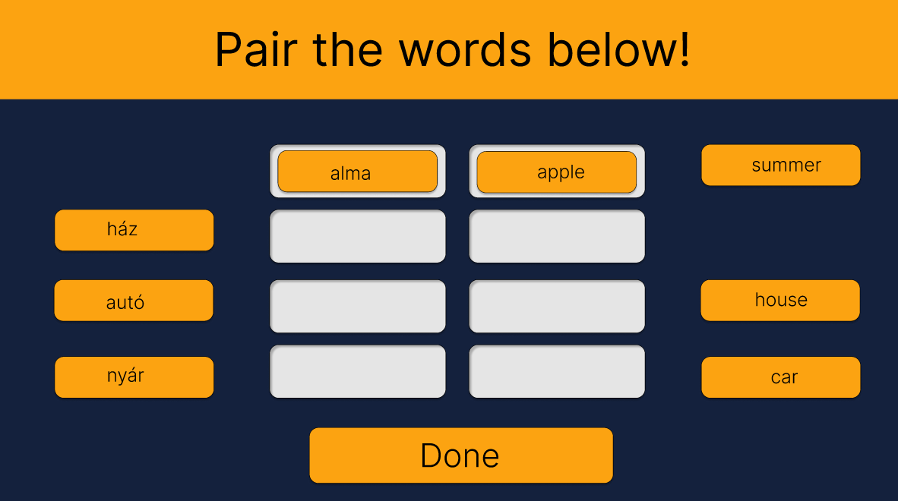

# **Funkcionális specifikáció**
## 1. A rendszer céljai és nem céljai.
* Az alkalmazásunk célja közé tartoznak a következők:
    * Játékos nyelvtanulás
    * Innovatív megoldás
    * Dekoratív design
    * Responszív felület
    * Minding rendelkezésre álljon
* Az alkalmazásunknak nem célja hogy:
    * Más platformokon müködjön
    * Több oldalt is kezeljen
    * További nyelvek használjon
    * A2-es szintnél magasabb nyelvtudást szerezzen az illető diák/személy
---
## 2. Jelenlegi helyzet leírása
* A megrendelő szeretné ha a nyelvtanulás minél hatékonyabb, modernebb és innovatívabb lenne. 
* A megrendelő szeretné, ha mindez egy mindenki számára elérhető, egyszerű elnevezéssel rendelkező weboldal formájában lenne megvalósítva.
* Azt szorgalmazza, hogy legyenek ilyen csempeszerű1 elemek, amiket lehessen ide-oda húzogatni2, s azokat a legvégén ellenőrizni lehessen például egy gomb segítségével. 
* Ha jó a megoldás, akkor ezt jelzi a felhasználónak (legyen gyerek vagy felnőtt) egy adott módon, s ha nem helyes szintúgy jelzi. 
* Továbbá, az alkalmazás egy piaci rés betöltésére lenne alkalmas
---
## 3. Vágyálom rendszer leírása
* A rendszerünk, mint azt fentebb is említettem, csempéknek1 (angolul *tiles*) nevezett elemeket fog használni a szavak párosításához, amiket be tud húzni előre meghatározott helyekre. 
* A felhasználó továbbá ellenőrizni is tudja a válaszainak a helyességét egy gombra kattintva az oldal alján, ami különböző algoritmusokkal ellenőrzi a válasz/párosítás helyességét. 
* A felhasználói felület egy alert-et használva fog megbizonyosodni válasza helyességéről, avagy annak helytelenségéről. A kimenet függvényében lehetősége lesz újrarendezni a kártyákat és azt újból ellenőriztetni a rendszerrel a gomb újboli lenyomásával.
* Ezen kívül pedig, a felhasználónak lehetősége van új szavak hozzáadására, amire egy felugró alert3 ablakon, avagy egy másik felületen lesz lehetősége.
---
## 4. A rendszerre vonatkozó külső megszorítások: pályázat, törvények, rendeletek, szabványok és ajánlások felsorolása
* A rendszernek/alkalmazásnak a következő megszorításokat kell tartalmaznia:
    * Nem szabad hogy felhasználó adatokat tároljon.
    * Tiltott a felhasználó azonosítására alkalmas sütik használata.
    * Innovatív technológiákat kell használnia, ami lehetőleg minden modern böngészőben működik
    * Nem szabad, hogy lefagyjon az alkalmazás
    * Tilos engednie trágár, explicit szavak hozzáadását és használatát
---
## 5. Jelenlegi üzleti folyamatok modellje
* Könyvből való szó tanulás:
    * Mai diákok nem preferálják a könyvből való tanulást
    * Könyvet magukkal kell hordaniuk a tanulóknak sőt ha többet akarnak tanulni akkor szótárt kell venniük
    * Könyvet eldobják ha már nem kell így hulladék keletkezik
    * Nem elég reszponzív és interaktív
* Tanuló önellenőrzése külön papíron:
    * Ez a módszer papír és toll igényes
    * Önellenőrzés után hulladék keletkezik
    * Sok időt elvesz az, hogy a tanuló felírja a szavakat
---
## 6. Igényelt üzleti folyamatok modellje
* Online elérhető, ingyenes rendszer létrehozása
    * Webes megjelenés mind mobilról (hordozhatóság), mind pedig számítógépről
* Átlátható design kialakítása a weboldalon
    * Dobozok alkalmazása
    * Elegáns design kialakítása
    * Letisztult , sima, de elegáns színű háttér
* Egyszerű betűtípus és betűszín alkalmazása
    * A weboldalon lévő adatok szerkeszthetővé tétele/Könnyű szerkeszthetőség
    * A már nem kívánatos szavak törölhetősége
---
## 7. Követelménylista
|Követelmény azonosító|      		      Leírás                      |
|        :----:       |			      :----:		          |
|         K01 	      |  Felhasználó/vendég tudja teljesíteni a feladatot illetve új magyar-angol szópárt tudjon bevinni |
|	  K02 	      |  Minden internetes keresőn elérhető legyen	  |
|	  K03 	      |  Reszponzív dizájn 				  |
|  	  K04 	      |  Egyszerűen legyen kezelhető az oldal		  |
|	  K05 	      |  Telefonon is elérhető legyen az oldal		  |
|	  K06 	      |  Az oldal alkalmazkodjon a kijelző méretéhez      |
---
## 8. Használati esetek
* Felhasználó:
    * A felhasználó vagy a vendég kitöltheti a tesztet vagy azt akár újra is kezdheti.
    * Illetve az ellenőrzéssel megtudhatják hogy jól vagy rosszul töltötték ki a tesztet.
    * Illetve ha a felhasználó szeretne új szavakat tanulni akkor ő is feltölthet a rendszerbe új magyar-angol szó párost.
* Admin:
    * Az admin ugyan úgy kitöltheti a tesztet vagy előröl kezdheti. Illetve ha kitölti a tesztet akkor megkaphatja ő is a választ, hogy jól vagy rosszul van kitöltve.
    * Ez által az admin le tudja tesztelni a programot, hogy az megfelelően működik e. 
    * Illetve ha nem elég a szavak száma akkor feltud vinni pár új magyar-angol szót a rendszerbe vagyis tudja bővíteni a szótárat egy külön kis panel segítségével ahova beírhatja a magyar szót és annak az angol megfelelőjét és egy gomb segítségével fel töltheti a szótárba.
---
## 9. Megfeleltetés, hogyan fedik le a használati esetek a követelményeket
* A program mindig jelzi egy adott esetnél, azaz szópárosításnál, hogy valóban angol-magyar szavak vannak-e összehúzva.  
 Ha végzett a pároztatással a felhasználó, akkor a "Done" gombra kattint. 
 Új szó hozzáadása esetén az "Add new word"-re kattint, ami egy másik oldalra viszi, hogy új szót 
 lehessen hozzáadni.
 ---
## 10. Képernyő tervek
* Úgy nézne ki az alkalmazás, hogy a képernyő bal és jobb oldalára is le lenne rakva négy-négy csempe.
 A bal oldalra kell behúzgálni az angol szavakat, jobb oldalra pedig a magyar szavakat. Ha a felhasználó, vagy a vendég jól párosítja a szavakat, akkor egy felugróablak fogadja majd, ami sikerességet fog mutatni,
 avagy pont az ellentétét vagyis hogy rossz volt a szavak párosítása.
* Az alkalmazás fő oldala: 
* Az alkalmazás egy párosítás után: 
---
## 11. Forgatókönyvek
* Futási időben egy szereplő figyelhető meg. Az alkalmazást elindítva megjelenik egy üres kezelőfelület, ezután
Az alkalmazást elindítva megjelenik bal és jobb oldalon négy-négy
 doboz, és össze kell az angol és magyar szavakat pároztatnia.
---
## 12. Funkció – követelmény megfeleltetés
* A funkció magát a projektnek a működését, funkcióját mutatja be, míg a követelmény a szabályt, és azt, hogy
 mik a követelményei annak, hogy elindítsuk a programunkat. A követelmények azokra az esetekre lettek felállítva amikor
 egy felhasználó rendszerezni akarja valamilyen rendszer szerint a teendőit. Ennek a legegyszerűbb esete amikor a programot
 használó személy az alapján szeretné rendszerezni teendőit, hogy mi az ami már készen van. Ez esetben a felhasználó létre
 tud hozni négy dobozt, bal, és jobb oldalon, amikbe az angol magyar szópárok kerülnek.
---
## 13. Fogalomszótár
1. Csempe: egy szürke terület a képernyőn, ami mutatja, hogy hova kell behúzni az idegen szavas kártyákat.
2. Ide-oda húzogatós megoldás: ez egy olyan módszer, angol kifejezéssel élve *drag and drop*, hogy valamire rákattintunk, azt nyomva tartjuk, és ezáltal át tudjuk húzni egy másik pontba, esetünkben a szó lefordított párja mellé, középre.
3. Alert ablak: a modern böngészők által közseretetten használt megoldás, arra hogy jelezzenek valami apróságot a felhasználónak. Ez általában egy kis ablakocska szokott lenni, ami a böngésző oldal tetejének a közepéből szokott lenyílni ugymond.