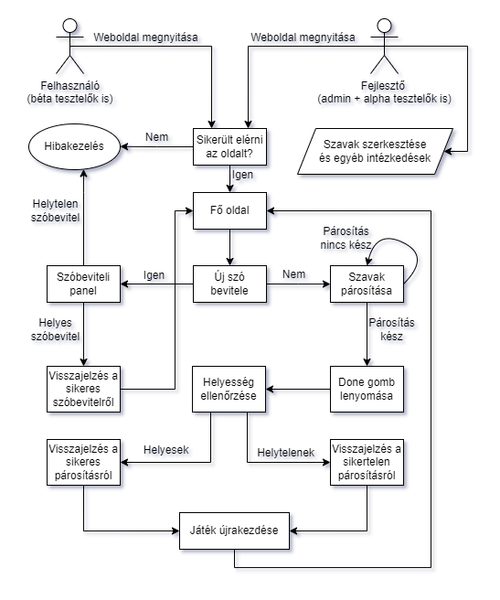
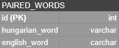

# **Funkcionális specifikáció**
## 1. A rendszer célja
* A rendszer célja, hogy a felhasználó gyakorolhassa az angol nyelvet, hiszen ez a mai világban már nélkülözhetetlen  
mivel ez a legjobban beszélt nyelv, és a legtöbb cég, vállalat angol. Fontos, hogy a felhasználó 
könnyen el tudjon igazodni a felületeken ezért minimális felhasználói 
felületet kap az alkalmazás. A tanár szerepkörrel rendelkező felhasználók 
tölthetik fel az angol és magyar szópárokat a feladatba.  A rendszer csak webes felületen lesz elérhető.  
Az már nem cél, hogy Androidos, vagy IOS eszközön fusson, mert arra külön rendszert kell, hogy fejlesszünk. 
 A megoldásra a felhasználó pontszámot kap.
---
## 2. Projektterv

---
## 3. Üzleti folyamatok modellje
* Üzleti szereplők:
    * **Felhasználó**: legyen az diák, gyermek, felnőtt vagy akár tanár/oktató is.
    * **Admin**: akinek jogosultsága van a rendszer karbantartására és szerkesztésére
    * **Tesztelők**: lehetnek akár fejlesztők (az alpha tesztelés esetében), vagy az alkalmazás béta tesztelői, akik véletlenszerűen lettek kiválasztva a felhasználói bázisból.
* Üzleti folyamatok:
    * Szópárok hozzáadása az alkalmazás elektronikus szótárához, mindezt egy külön felületen, vagy egy alert (lásd a funkcionális specifikációban a jelentését) ablakban.
    * Visszajelzés a szópárok helyes beviteléről
    * Szó-csempék húzogatása az oldal két széléről az erre előre elkészített helyekre, vagyis a weboldal körülbelüli közepére.
    * Szópárok ellenőrzése a webalkalmazás alján található gombbal.
    * Visszajelzés a szó párosítások helyességéről egy felugró ablakban, vagy a fenti szöveges sávon.
* Üzleti entitások:
    * Maga a webalkalmazás (mivel maga az alkalmazás csekély méretű)
* Szemléltető folyamatábra:

---
## 4. Követelmények

---
## 5. Funkcionális terv

---
## 6. Fizikai környezet

---
## 7. Absztrakt domain modell
* JSF-et fogunk használni, mert az egyszerűbb, mint  a HTML, CSS, Javasript.

---
## 8. Architekturális terv
* A webes alkalmazásunkban a backend illetve a frontend szerepét a JSF tölti be, ami alapvetően Java alapú, illetve *.xhtml* kiterjesztésű elemeket használ úgymond egyfajta frontendre (itt tudunk hivatkozni a Java osztályokban lévő adattagokra és metódusokra/osztályokra)
* A rendszer backendje, a JSF, MySQL adatbázist fog használni, XAMPP lokális szerver hosttal.
* Ezen kívül, használva lesz még a Spring Boot keretrendszer, illetve még a Spring Core is. Mindezeket a fejlesztés és jövőbeli bővíthetőség megkönnyítése érdekében alkalmazzunk, illetve hogy megfeleljen az ipari standardoknak.
* A webalkalmazás host-olása Tomcat-tel lesz megoldva, amit a már fentebb is említett Spring Boot fog biztosítani.
* A frontend pedig a JSF-en belül lesz lefejlesztve, formoknak nevezett XHTML oldalakkal, amit a JSF átalakít nekünk használható oldallá
* A design elemek, a PrimeFaces-nek köszönhetően lesznek megvalósítva, amik esetlegesen felül lesznek írva saját, általunk megírt CSS stíluslapokkal
* Az alkalmazásban minel sűrűbben lesznek alkalmazva a SOLID alapelveket, illetve további design és architekturális minták
  * Az MVC architekturális minta például már alapból használva lesz, mivel a JSF ezt követi
* Az alkalmazásnak több rétege is lesz, az MVC-n kívül, mint például perzisztencia réteg, üzleti logika, kliens oldal (ezekről az Implementációs tervben lesz bővebben szó)
* A rendszer a Spring-nek illetve a JSF-nek köszönhetően nagyon egyszerűen lesz bővíthető, illetve karbantartható.
* A weboldal biztonságát az biztosítja, hogy nincsenek semmilyen harmadik féltől származó sütik használva, amikkel azonosítani lehetne a felhasználót, illetve nincsenek is ilyen sütik elküldve a backendtől.
  * Továbbá, mivel nem tárol az alkalmazás semmilyen felhasználói adatot explicit módon, ezért nincsenek GDPR szabályszegések sem.
---
## 9. Adatbázis terv
* A szavak tárolására MySQL adatbázis rendszert fog használni a rendszer
* Tekintve, hogy az alkalmazás kis méretű, az adatbázis szerver lokálisan fog működni, a XAMPP eszközt használva.
* Az alkalmazás kihelyezése után, nagy eséllyel egy nagyobb szolgáltatót fog használni az alkalmazás, az adatbázis szerver host-olására.
* Az webalkalmazás egyetlen táblát fog használni, mivel mérete nem indokolja több tábla használatát.
* Az adatbázis modelljének diagrammja a következő képpen néz ki:

---
## 10. Implementációs terv

---
## 11. Tesztterv
* Egy alkalmazás készítésekor nagyon fontos szerepet töltenek be a teszttervek. 
A teszttervek segítségével tudunk különféle funkciók helyes működéséről meggyőződni, 
 és a különféle üzleti szolgáltatások hitelesítéséről is. 
A szoftver kiadása előtt 2 tesztet kell végrehajtani, melyek az alpha illetve beta tesztek.

* Alpha teszt
    * Fejlesztő csapat fogja elvégezni.
    * Ezen teszt során azt vizsgáljuk, hogy az alkalmazás hogyan reagál különboző böngészői környezetekben, 
     és az adott funkciók működőképesek-e.
    * Ha azt látjuk, hogy az előző feltételek megfelelnek, akkor sikeres volt az alpha teszt, és jöhet majd a beta teszt.

* Beta teszt
    * A beta tesztet a fejlesztő csapattól független, kívülálló személyek fogják elvégezni.
    * Ennek a tesztnek az a célja, hogy a felhasználóktól visszajelzést kapjanak a  
    fejlesztők az alkalmazás működésével kapcsolatban.

* Amennyiben hibás működésbe ütköznek a felhasználók, akkor egy tesztelési naplóban  
felvezetik a tapasztalataikat, és azt visszaküldik a fejlesztőknek, a fejlesztők pedig megoldják a hibát.

* Tesztelésre használt eszközök
Böngészők: Google Chrome , Mozilla Firefox, Microsoft Edge  
Operációs rendszer: Windows 10 

---
## 12. Telepítési terv

---
## 13. Karbantartási terv
* Az alkalmazás folyamatos üzemeltetése és karbantartása, mely  
magában foglalja a programhibák kijavítását, a belső igények változása miatti  
módosításokat, valamint a környezeti feltételek változása miatt  
megfogalmazott program-, és állomány módosítási igényeket is.  
A szoftveren havonta szeretnénk karbantartásokat végezni, ezen felül bármilyen  
felhasználói hibajelentés után azonnali helyreállítás jön. A szoftveren évente nagyobb 
 frissítések, módosítások fordulhatnak elő.  
Idő elteltével új kategóriákat kell hozzáadni az apphoz, hogy fent tartsuk az  
érdeklődési szintet.

