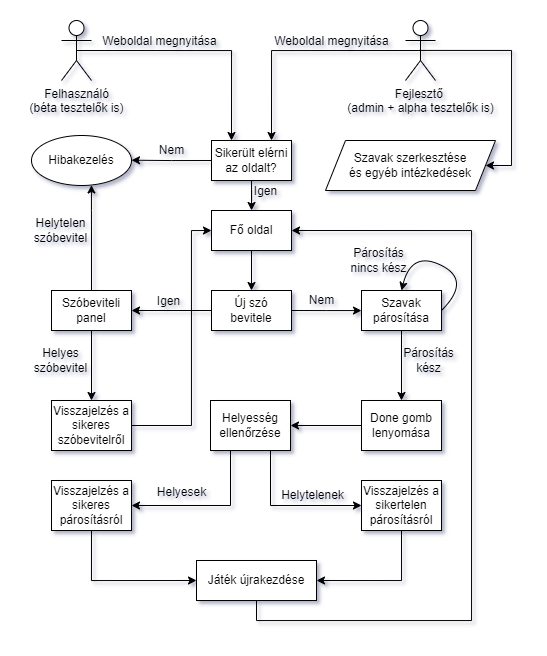
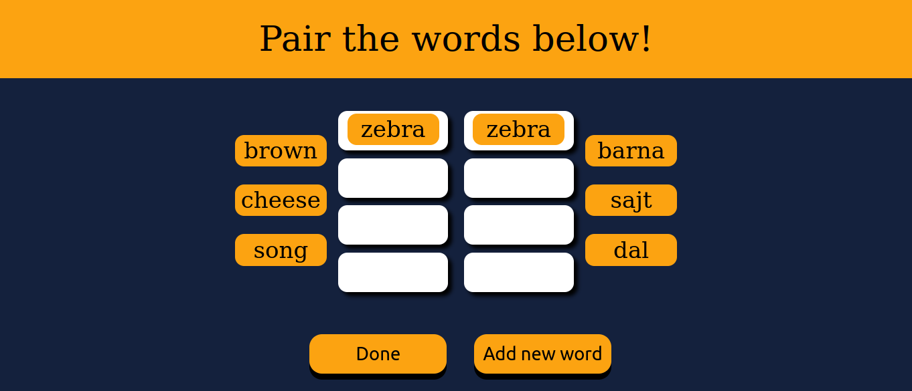
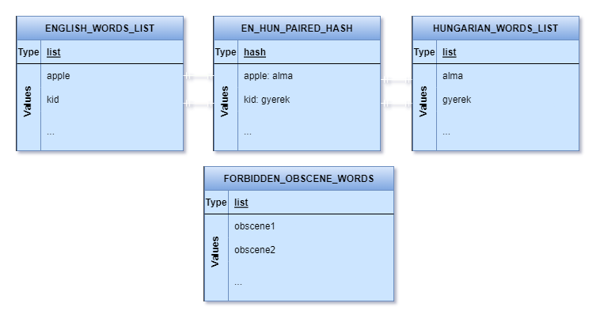

# **Funkcionális specifikáció**
## 1. A rendszer célja
* A rendszer célja, hogy a felhasználó gyakorolhassa az angol nyelvet, hiszen ez a mai világban már nélkülözhetetlen  
mivel ez a legjobban beszélt nyelv, és a legtöbb cég, vállalat angol. Fontos, hogy a felhasználó 
könnyen el tudjon igazodni a felületeken ezért minimális felhasználói 
felületet kap az alkalmazás. A tanár szerepkörrel rendelkező felhasználók 
tölthetik fel az angol és magyar szópárokat a feladatba.  A rendszer csak webes felületen lesz elérhető.  
Az már nem cél, hogy Androidos, vagy IOS eszközön fusson, mert arra külön rendszert kell, hogy fejlesszünk. 
 A megoldásra a felhasználó pontszámot kap.
---
## 2. Projektterv
### Projektszerepkörök, felelősségek:
* Scrum master: Varga József-Márk, Bódi András, Cserés Gábor
* Product owner: Varga József-Márk, Bódi András, Cserés Gábor

### Projektmunkások és felelőségek:

* Backend munkálatok:
    * Varga József-Márk, Bódi András, Cserés Gábor
         * Feladatuk a funkciók létrehozása illetve adatok tárolása
* Frontend:
    * Varga József-Márk, Bódi András, Cserés Gábor
         * Feladatuk a weboldal megjelenítése
### Ütemterv:

|          Funkció        |Feladat|Prioritás|Becslés|Aktuális becslés|Eltelt idő|Hátralévő idő|
|          :----:         |:----: |  :----: | :----:|     :----:     |  :----:  |    :----:   |
|Követelmény specifikáció |       |0	    |7      |7               |7		|       0     |
|Funkcionális specifikáció| 	  |0	    |7	    |7		     |7		|	0     |
|       Rendszerterv      | 	  |0        |7      |7		     |7		|	0     |
|         Frontend        | 	  |2   	    |7      |7	       	     |0		|	7     |
|         Backend         | 	  |2	    |7      |7		     |0		|	7     |
---
## 3. Üzleti folyamatok modellje
* Üzleti szereplők:
    * **Felhasználó**: legyen az diák, gyermek, felnőtt vagy akár tanár/oktató is.
    * **Admin**: akinek jogosultsága van a rendszer karbantartására és szerkesztésére
    * **Tesztelők**: lehetnek akár fejlesztők (az alpha tesztelés esetében), vagy az alkalmazás béta tesztelői, akik véletlenszerűen lettek kiválasztva a felhasználói bázisból.
* Üzleti folyamatok:
    * Szópárok hozzáadása az alkalmazás elektronikus szótárához, mindezt egy külön felületen, vagy egy alert (lásd a funkcionális specifikációban a jelentését) ablakban.
    * Visszajelzés a szópárok helyes beviteléről
    * Szó-csempék húzogatása az oldal két széléről az erre előre elkészített helyekre, vagyis a weboldal körülbelüli közepére.
    * Szópárok ellenőrzése a webalkalmazás alján található gombbal.
    * Visszajelzés a szó párosítások helyességéről egy felugró ablakban, vagy a fenti szöveges sávon.
* Üzleti entitások:
    * Maga a webalkalmazás (mivel maga az alkalmazás csekély méretű)
* Szemléltető folyamatábra: 

---
## 4. Követelmények
* Funkcionális követelmények:
    * Felhasználó tudja a szavakat mozgatni, hogy az angol szót a magyar megfelelőjével tudja párosítani
    * Felhasználó csak a kijelölt helyre tudja mozgatni a szavakat
    * Egy gomb segítségével tudja ellenőrizni a felhasználó, a megoldásait
    * Ellenőrző gomb lenyomásával pedig az oldal meg mondja, hogy a megoldás hibátlan vagy hibás
    * Egy másik gombbal pedig előröl tudja kezdeni a szavak húzgálását
    * Legyen egy külön felület ahol angol-magyar szavakat lehet a rendszerbe bevinni még
    * Lehessen szavakat kivenni
    * A weboldal a legtöbb böngészőt támogassa
    * A weboldalt lehessen telefonon is használni
    * Egyszerűen legyen kezelhető az oldal	

* Nem funkcionális követelmények:
    * Felhasználók adatait ne tárolhassák el, illetve felhasználó ne tárolhasson adatokat
    * Felhasználót ne lehessen azonosítani

* Törvényi előírások, szabványok:
    * GDPR-nek való megfelelés.
---
## 5. Funkcionális terv
* A webalkalmazásunknak az a célja, hogy az embereket segítsük az angol szavak tanulásában. 
* Rendszerszerepkörök:
    * Felhasználó(user)
    * Fejlesztő

* Rendszerhasználati esetek és lefutásaik:
    * Felhasználó(user):
        * Képes a szavakat ide-oda huzgálni
        * Letudja ellenörizni a megoldásait
        * Előröl tudja kezdeni a feladatot
        * Tud magyar-angol szópárt kivenni
        * Tud magyar-angol szópárt hozzáadni
    * Fejlesztő:
        * A fejlesztő végre tudja hajtani azokat a dolgokat mint a felhasználó
        * A weboldal kódján tud változtatni és tesztelni

* 1 - A felhasználó párosítja a szavakat 
* 2 - A done lenyomásával kap egy ablakot/szöveget amiben szerepel az, hogy a feladat hibátlan vagy hibás

* Menü hierarchiák:
    * Fő oldal:
        * Feladat

---
## 6. Fizikai környezet
* Az alkalmazás web platformra készül így különféle eszközökön is lehet használni ha van rajtuk böngésző
* Operációs rendszer független
* Nincsenek megvásárolt komponenseink
* Van tűzfal a hálózaton és minden portot is engedélyez

* Fejlesztési környezet:
    * Intellij Idea
    * Git
---
## 7. Absztrakt domain modell
* JSF-et fogunk használni, mert az egyszerűbb, mint  a HTML, CSS, Javasript.

---
## 8. Architekturális terv
* A webes alkalmazásunkban nem lesz használva külön backend, hiszen az adatok manipulálására JavaScript-et fogunk használni.
  * Továbbá, az alkalmazás kicsi mérete nem indokolja külön backend megírását
* A weboldal tehát alapvetően HTML-et fog használni az elemek összefűzésére, CSS-t az elemek stilizálására, végezetül pedig JavaScript-ek az előbbiekben is említett elemek illetve az adatok manipulálására (ez tölti be úgymond a backend szerepét).
  * Ennek a hármasnak köszönhetően, ha minimálisan is, szét fogjuk tudni választani az alkalmazás modelljét, annak nézetétől és úgymondd a kontrollerétől (MVC architekturális minta).
* A különböző események kezelésére, mint például a szó-csempék húzogatása, a *draggable* attribútumot használva, JavaScript-et fogunk használni, ahol is le lesz kezelve az összes esemény.
  * Ide beleértem a következőket: csempe megfogása, annak elengedése, helyére rakása stb.
* A webalkalmazásunk hostolására a Github Pages-t fogjuk használni, aminek köszönhetően mindíg elérhető lesz az oldal, bárhonnan a világból.
* Az adatok tárolására, perzisztálására egy NoSQL adatbázist fog használni az alkalmazás, azon belül is a Redis-t.
* A weboldal biztonságát az biztosítja, hogy nincsenek semmilyen harmadik féltől származó sütik használva, amikkel azonosítani lehetne a felhasználót, illetve nincsenek is ilyen sütik elküldve a backendtől.
  * Továbbá, mivel nem tárol az alkalmazás semmilyen felhasználói adatot explicit módon, ezért nincsenek GDPR szabályszegések sem.
---
## 9. Adatbázis terv
* A szavak tárolására NoSQL adatbázis rendszert fog használni a rendszer, azon belül is a Redis-t
* Mivel a Redis lehetőséget ad ingyenes szerver és adatbázis host-ra, ezért a Redis Cloud online szolgáltatását használjuk az adatbázis hostol-ására.
* Az alkalmazás kihelyezése után, nagy eséllyel elő lesz fizetve egy nagyobb plan, ami több tárhelyet ad.
* Az webalkalmazás három adatszerkezetet (mivel a Redis egy memória-beli kulcs-érték adatbázis) fog használni, két listát a magyar illetve angol szavakkal, egy hash-t amiben az angol-magyar szó párosítások lesznek, és egy obszcén szavakat tartalmazó listát, hogy az új szavak bevitelénél, a felhasználó ne tudhasson bevinni csúnya, trágár szavakat.
* Az adatbázis eljárások között szerepelni fog szavak felvitele, illetve törlése az adatbázisból.
  * A fentieken kívül pedig, le lesznek kérve, illetve filterezve is lehetnek az elemek.
* Az adatbázis modelljének diagrammja a következő képpen néz ki: 

---
## 10. Implementációs terv
* Mint azt fentebb is említettem, az alkalmazásunk HTML-t, CSS-t, JavaScript-et illetve Python-t fog használni a működéséhez.
  * Ez által minimális, ám bár tisztán MVC-nek nem mondható, MVC architekturális mintát tudunk követni, ahol el tudjuk szeparálni egymástól a modellt, kontrollert és nézetet.
* Függőségek kezelésére nem feltétlen van szükség, mivel az alkalmazásban egyetlen külső python module/library van használva, a *redis*, a backend-en belül.
* Alkalmazásunk továbbá 3 különböző réteget fog tartalmazni:
  * Perzisztencia réteg: ez egy python fájl lesz, ami kezeli a redis adatbázist, mely a következő funkcionalitásokkal fog rendelkezni:
    * Mint például: szavak beszúrása
  * Üzleti logika réteg: ez egyfajta validátor lesz, ami ellenőrizni fogja a szavakat, hogy helyesen lettek-e össze-párosítva és egyéb ellenőrzéseket fog végezni.
    * A backend részen is lesz egy ilyen service réteg, ahol a felhasználó által bevitt szavakat ellenőrzi.
  * Kliens réteg: ez lesz maga az *App* nevezetű JavaScript fájl, ami használja, ha explicit módon nem is, használja az összes többi réteget.
    * A backend-et API hívásokkal éri el.
* A backend oldalon Flask van használva, amiben egy REST API van írva, amivel majd a frontend kommunikál. 
* Az előbbieknek köszönhetően pedig, szépen tudjuk követni az *Egyszeres Felelősség Elvét* (angolul *Single Responsibility Principle* - a SOLID elvekből az elsőt), ami lehetővé fogja tenni az alkalmazás egyszerűbb és átláthatóbb karbantartását.
---
## 11. Tesztterv
* Egy alkalmazás készítésekor nagyon fontos szerepet töltenek be a teszttervek. 
A teszttervek segítségével tudunk különféle funkciók helyes működéséről meggyőződni, 
 és a különféle üzleti szolgáltatások hitelesítéséről is. 
A szoftver kiadása előtt 2 tesztet kell végrehajtani, melyek az alpha illetve beta tesztek.

* Alpha teszt
    * Fejlesztő csapat fogja elvégezni.
    * Ezen teszt során azt vizsgáljuk, hogy az alkalmazás hogyan reagál különboző böngészői környezetekben, 
     és az adott funkciók működőképesek-e.
    * Ha azt látjuk, hogy az előző feltételek megfelelnek, akkor sikeres volt az alpha teszt, és jöhet majd a beta teszt.

* Beta teszt
    * A beta tesztet a fejlesztő csapattól független, kívülálló személyek fogják elvégezni.
    * Ennek a tesztnek az a célja, hogy a felhasználóktól visszajelzést kapjanak a  
    fejlesztők az alkalmazás működésével kapcsolatban.

* Amennyiben hibás működésbe ütköznek a felhasználók, akkor egy tesztelési naplóban  
felvezetik a tapasztalataikat, és azt visszaküldik a fejlesztőknek, a fejlesztők pedig megoldják a hibát.

* Tesztelésre használt eszközök
Böngészők: Google Chrome , Mozilla Firefox, Microsoft Edge  
Operációs rendszer: Windows 10 

---
## 12. Telepítési terv
* Adatbázis telepítése
  * Fejlesztés alatt:
    * Mivel Redis-t használ az alkalmazás, van lehetőség ingyen adatbázis host-olásra, redis cloud-ot használva, egészen 30MB tárhelyig, ami a fejlesztésre bőven elég, hiszen csak szavakat tárolunk.
  * Deploy után:
    * Az alkalmazás kihelyezése után ajánlatos egy fizetett plan-re váltani a Redis Cloud-ban, ami lehetővé teszi több konkurens használatot, illetve nagyobb tár kapacitást.
* Szerver telepítés
  * Fejlesztés alatt:
    * A frontend esetében elegendő ha egy Visual Studio Code-beli live server-t nyitunk meg
    * A backend-nél pedig elegendő a fő *app.py* fájl futtatása
* Alkalmazás telepítése
  * Fejlesztés alatt:
    * Nincs szükség telepítésre, hiszen a fejlesztő környezetből (*Visual Studio Code*) van lehetőség live server nyitására is, vagy csak egyszerűen megnyitjuk az index.html oldalt egy tetszőleges webböngészőben.
---
## 13. Karbantartási terv
* Az alkalmazás folyamatos üzemeltetése és karbantartása, mely  
magában foglalja a programhibák kijavítását, a belső igények változása miatti  
módosításokat, valamint a környezeti feltételek változása miatt  
megfogalmazott program-, és állomány módosítási igényeket is.  
A szoftveren havonta szeretnénk karbantartásokat végezni, ezen felül bármilyen  
felhasználói hibajelentés után azonnali helyreállítás jön. A szoftveren évente nagyobb 
 frissítések, módosítások fordulhatnak elő.  
Idő elteltével új kategóriákat kell hozzáadni az apphoz, hogy fent tartsuk az  
érdeklődési szintet.

